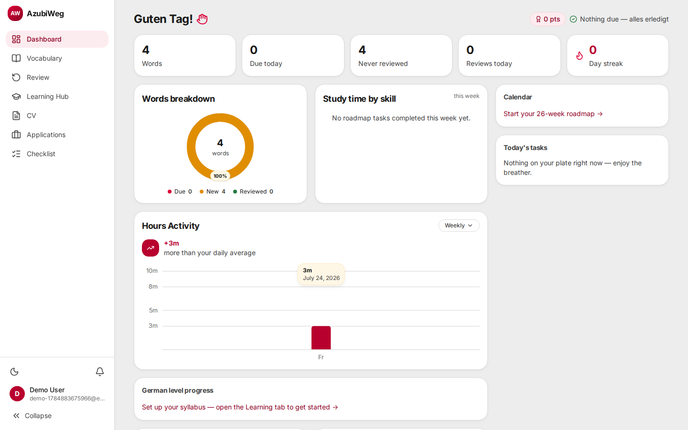
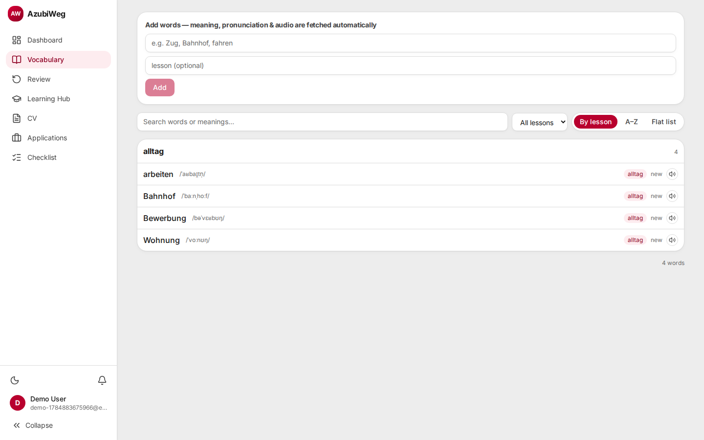
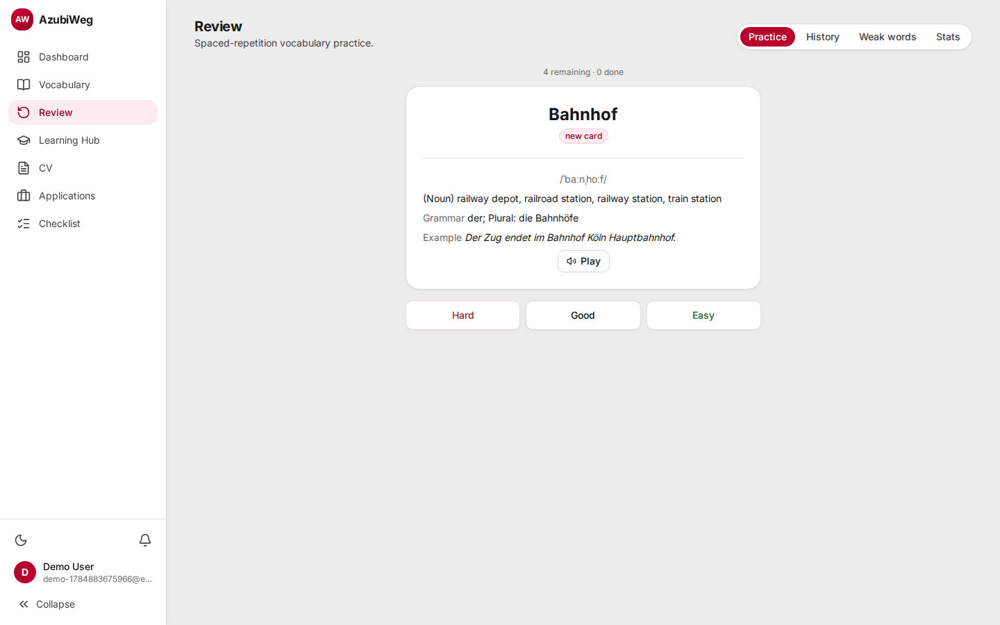
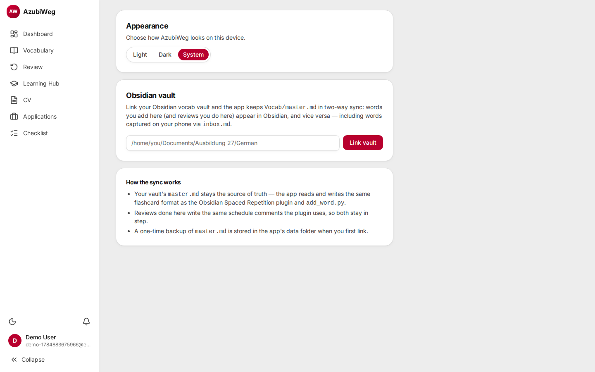
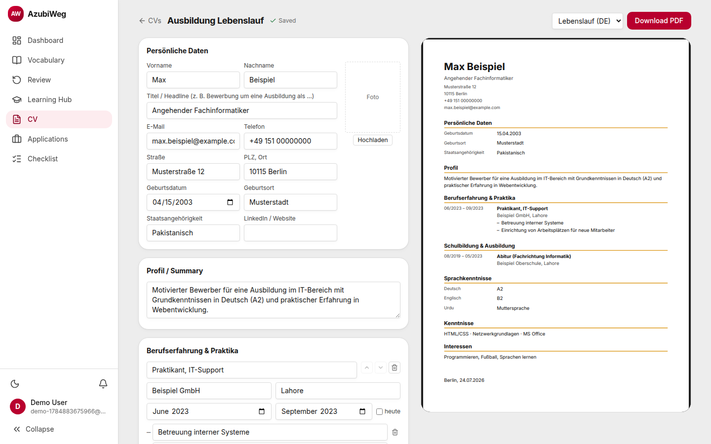
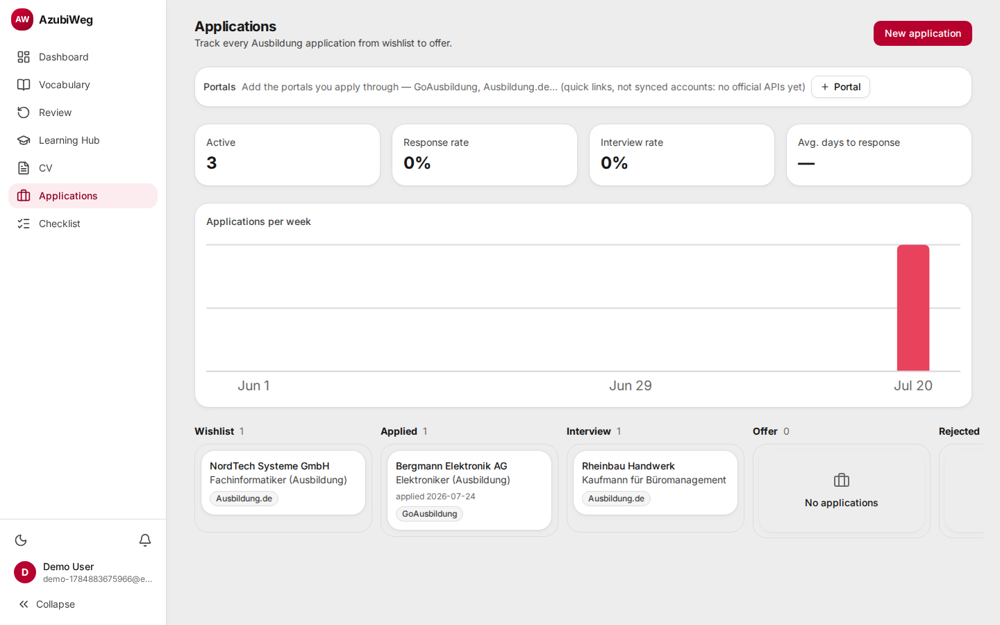
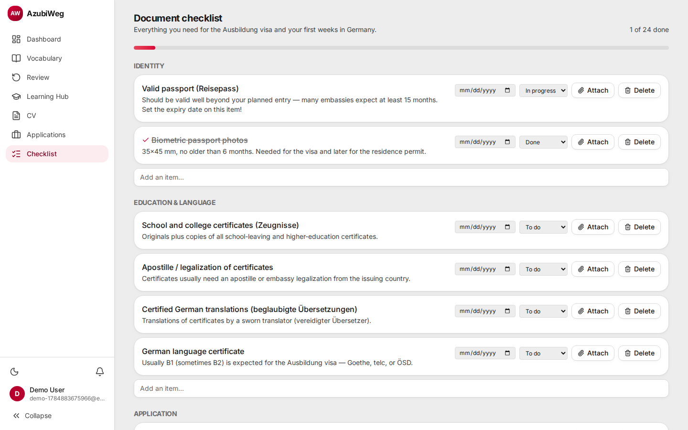

# AzubiWeg 🇩🇪

A platform for people preparing to move to Germany — built by someone doing exactly that.

I'm preparing for an Ausbildung in Germany: learning German, collecting documents,
tracking applications. This app solves the problems I hit along the way. **V1** is
a German vocabulary manager with spaced-repetition review, kept in **two-way sync
with my Obsidian vault**. **V2** adds the application side: a CV builder with live
PDF preview, a kanban application tracker, and a document checklist for the
Ausbildung visa process. **V3** adds a Learning Progress Hub — a CEFR syllabus, a
day-by-day study roadmap, self-tests, and gamification — feeding a richer dashboard.



## What V1 does

- **Accounts** — email + password, JWT sessions.
- **Vocabulary manager** — search, filter by lesson, expand for full detail
  (meaning, IPA, grammar, example, pronunciation audio).
  
- **Automatic enrichment** — type `Zug, Bahnhof, fahren` and the backend fetches
  meaning (en.wiktionary), IPA + gender/plural/verb forms + an example sentence
  (de.wiktionary wikitext), and pronunciation audio (Wikimedia Commons recording,
  converted to MP3 with ffmpeg; free Microsoft Edge neural TTS as fallback).
- **Daily revision** — SM-2 spaced repetition, byte-compatible with the
  [Obsidian Spaced Repetition plugin](https://github.com/st3v3nmw/obsidian-spaced-repetition)'s
  scheduling (verified against real plugin output).
  
- **Obsidian vault sync** — the killer feature:
  

### How the vault sync works

The vault's `Vocab/master.md` is the **source of truth**. The app watches it (and
`inbox.md`, for words captured on iOS) and mirrors changes into Postgres within
seconds, then writes its own edits — added words, reviews, grades — back into the
exact same flashcard format, **byte-identical** (verified against a real vault
snapshot). Reviews done in the app and in Obsidian update the same
`<!--SR:!date,interval,ease-->` comments, so both schedulers stay in step.

## What V2 adds

- **CV builder** — a form with a **live PDF preview** beside it; the preview and
  the exported file come from the same `@react-pdf/renderer` components, so what
  you see is exactly what you download. Two templates: a classic tabular German
  **Lebenslauf** (photo, Persönliche Daten, Ort/Datum signature line) and an
  **ATS-friendly** single-column English CV that deliberately omits photo, birth
  data, and nationality. Multiple CVs per account for tailoring per Betrieb;
  debounced autosave; German-proof PDF rendering (embedded Inter, hyphenation
  disabled so compounds like „Krankenversicherung" don't get mangled).
  
- **Application tracker** — drag-and-drop kanban (Wishlist → Applied → Interview →
  Offer / Rejected) with an auto-logged timeline per application (status changes,
  notes, interviews), the CV that was sent, and stats: response rate, interview
  rate, average days to response, applications per week.
  
- **Document checklist** — seeded with ~24 items a non-EU Ausbildung applicant
  actually needs (Zeugnisse + apostille + certified translations, B1/B2
  certificate, §16a visa paperwork, VIDEX, Sperrkonto *or* salary proof,
  Anmeldung, Aufenthaltstitel, …), each with status, **file attachments** (PDF
  scans live with the item), and an expiry date that drives warning badges and a
  "documents needing attention" section on the dashboard.
  

## What V3 adds

- **CEFR syllabus** — 174 seeded topics (grammar/vocab/skill) across A1, A2, and
  B1. Checking items off drives per-level completion percentage and "what's
  next" suggestions.
- **Day-by-day roadmap** — a 182-day (26-week) study plan to Goethe-exam
  readiness, generated live from syllabus progress, with a calendar view and
  overdue backlog.
- **Study-source registry** — register YouTube playlists, Nicos Weg chapters,
  or Duolingo units and self-log progress, since none of these platforms
  expose a progress API.
- **Self-tests & Goethe readiness** — a 163-question bank built from syllabus
  topics and vocab/SRS data, with weekly/monthly readiness rollups.
- **Gamification & activity tracking** — points, 15 badges, and day-streaks
  computed from real activity, feeding the dashboard's activity history.
- **Notifications & portals** — on-demand reminders (stale applications,
  expiring documents) and quick-link bookmarks to platforms like GoAusbildung,
  since none of them offer account sync or public APIs.

## Stack

| Layer | Choice |
|---|---|
| Frontend | React 19, TypeScript, Tailwind CSS 4, TanStack Query, React Router, Vite |
| Backend | Node.js, Express 5, TypeScript |
| Database | PostgreSQL, Prisma 7 |
| Auth | JWT (jsonwebtoken) + bcrypt |
| Vault sync | chokidar file watcher, custom markdown parser/writer |
| Enrichment | Wiktionary REST + MediaWiki APIs, ffmpeg, msedge-tts |
| PDF export | @react-pdf/renderer (client-side, lazy-loaded) |
| Kanban | @dnd-kit |
| Uploads | multer → per-user disk storage, auth-checked streaming |

## Running it

```bash
# 1. Database — either:
docker compose up -d               # standard Postgres in Docker, or
cd server && npm run db:start      # no Docker/root needed (embedded-postgres)

# 2. Server
cd server
npm install
cp .env.example .env               # set JWT_SECRET
npx prisma migrate dev
npm run dev                        # http://localhost:3000

# 3. Client
cd client
npm install
npm run dev                        # http://localhost:5173 (proxies /api)
```

Then register, and (optionally) link your Obsidian vault under **Settings** —
point it at the vault root, the folder containing `Vocab/master.md`.

## Tests

```bash
cd server && npm test
```

Covers the vault sync's byte-identical round-trip, SRS scheduling parity with
the Obsidian plugin, and pure-logic suites for applications, CVs, checklist
reminders, and the Learning Hub (roadmap generation, quizzes, gamification,
activity tracking).

## Deployment

Self-hostable on a free-tier VPS — see [docs/DEPLOYMENT.md](docs/DEPLOYMENT.md)
for the full runbook (GCP e2-micro, Caddy + auto-TLS, DuckDNS DNS with an
`eu.org` application pending, and bridging the Obsidian vault sync over
OneDrive/rclone when the app isn't on the same machine as the vault).

## Roadmap

See [docs/ROADMAP.md](docs/ROADMAP.md) for the full ecosystem plan and feature specs.

- ~~**V2** — CV builder (live preview, German/ATS templates, PDF export),
  application tracker (kanban + stats), document checklist with expiry reminders.~~ ✅
- ~~**V3 — Learning Progress Hub**~~ ✅ CEFR syllabus, day-by-day roadmap,
  self-tests, gamification, activity tracking. The **salary & cost planner**
  and **Germany knowledge base** were also scoped here but haven't shipped —
  carried forward, unscheduled.
- **V4 — Applications, deeper** — Ausbildung opportunity discovery (search/
  filters/bookmarks feeding the kanban), cover letter assistant, Europass CV
  template, automated ATS checks, dashboard upgrades (certificates, GitHub
  activity).
- **V5 — Infrastructure & polish** — vocab PDF export and CLI, GitHub Actions
  CI, calendar integration, grammar micro-lessons.
