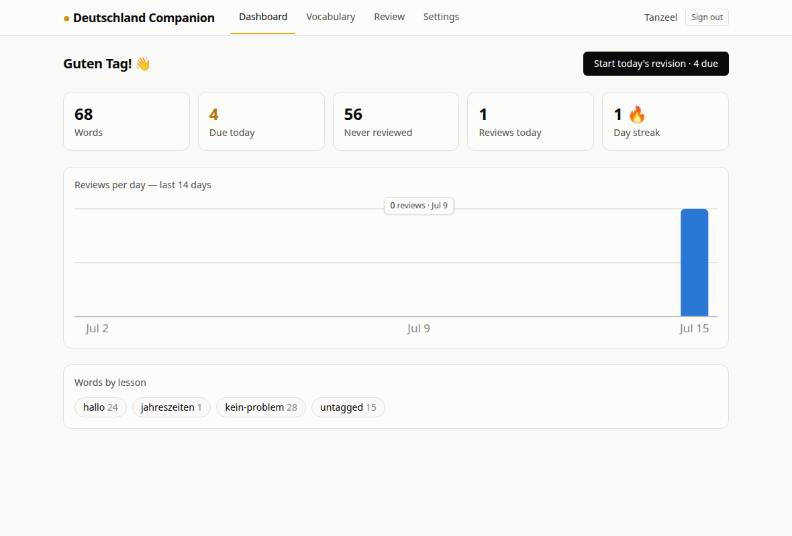

# Deutschland Companion 🇩🇪

A platform for people preparing to move to Germany — built by someone doing exactly that.

I'm preparing for an Ausbildung in Germany: learning German, collecting documents,
tracking applications. This app solves the problems I hit along the way, starting
with the biggest one — vocabulary. **Version 1** is a German vocabulary manager with
spaced-repetition review that stays in **two-way sync with my existing Obsidian
vault**, so my phone capture workflow and Obsidian reviews keep working while the
web app adds search, statistics, and a proper review UI on top.



## What V1 does

- **Accounts** — email + password, JWT sessions.
- **Vocabulary manager** — search, filter by lesson, expand for full detail
  (meaning, IPA, grammar, example, pronunciation audio).
  
- **Automatic enrichment** — type `Zug, Bahnhof, fahren` and the backend fetches
  meaning (en.wiktionary), IPA + gender/plural/verb forms + an example sentence
  (de.wiktionary wikitext), and pronunciation audio (Wikimedia Commons recording,
  converted to MP3 with ffmpeg; free Microsoft Edge neural TTS as fallback).
- **Daily revision** — SM-2 spaced repetition, byte-compatible with the
  [Obsidian Spaced Repetition plugin](https://github.com/st3v3nmw/obsidian-spaced-repetition)'s
  scheduling (verified against real plugin output).
  
- **Obsidian vault sync** — the killer feature:
  

### How the vault sync works

The vault's `Vocab/master.md` is the **source of truth**; the database is a
queryable mirror. The server:

- parses the flashcard format (`- **word** :: back` + `<!--SR:…-->` schedule
  comments) and **round-trips it byte-identically** (enforced by tests against a
  real vault snapshot);
- watches `master.md` with chokidar — edits made in Obsidian, by sync from the
  phone, or by the original `add_word.py` script appear in the app within seconds;
- watches `inbox.md` — words captured on iOS get enriched into full flashcards
  automatically, replicating the Python workflow;
- writes app-side changes (added words, edits, review grades) back into the same
  format, atomically, with hash-based echo suppression so its own writes don't
  trigger re-syncs;
- backs up `master.md` into `server/data/` the first time it links a vault.

Reviews done in the app and reviews done in Obsidian update the same
`<!--SR:!date,interval,ease-->` comments, so both schedulers stay in step.

## Stack

| Layer | Choice |
|---|---|
| Frontend | React 19, TypeScript, Tailwind CSS 4, TanStack Query, React Router, Vite |
| Backend | Node.js, Express 5, TypeScript |
| Database | PostgreSQL, Prisma 7 |
| Auth | JWT (jsonwebtoken) + bcrypt |
| Vault sync | chokidar file watcher, custom markdown parser/writer |
| Enrichment | Wiktionary REST + MediaWiki APIs, ffmpeg, msedge-tts |

## Running it

```bash
# 1. Database — either:
docker compose up -d               # standard Postgres in Docker, or
cd server && npm run db:start      # no Docker/root needed (embedded-postgres)

# 2. Server
cd server
npm install
cp .env.example .env               # set JWT_SECRET
npx prisma migrate dev
npm run dev                        # http://localhost:3000

# 3. Client
cd client
npm install
npm run dev                        # http://localhost:5173 (proxies /api)
```

Then register, and (optionally) link your Obsidian vault under **Settings** —
point it at the vault root, the folder containing `Vocab/master.md`.

## Tests

```bash
cd server && npm test
```

The critical suites: byte-identical round-trip of a real `master.md` snapshot
(`tests/vault-roundtrip.test.ts`) and SRS parity with real plugin output
(`tests/srs.test.ts`).

## Roadmap

- **V2** — CV builder (live preview, German/ATS templates, PDF export),
  application tracker (kanban + stats), document checklist with expiry reminders.
- **V3** — cost planner, Germany knowledge base (visa, Anmeldung, blocked account,
  insurance…), progress analytics.
- **V4** — cover letter assistant, notifications, calendar integration, grammar
  micro-lessons.
