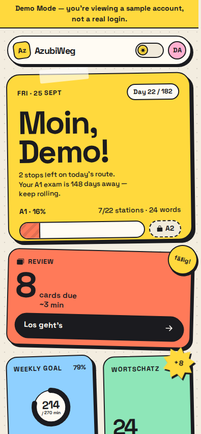
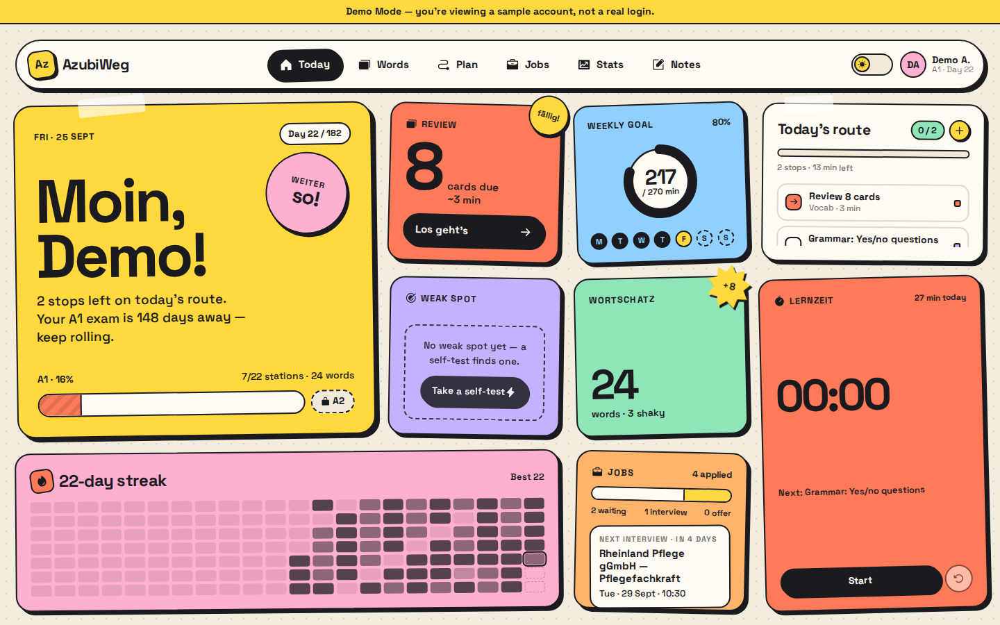
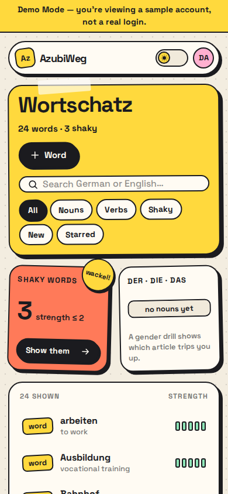
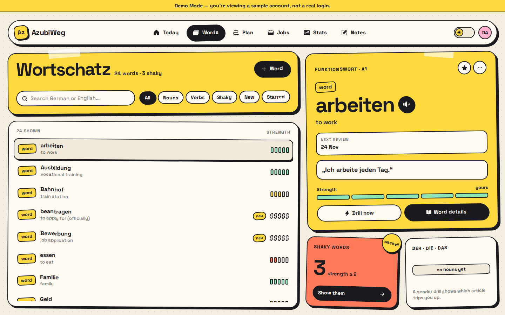
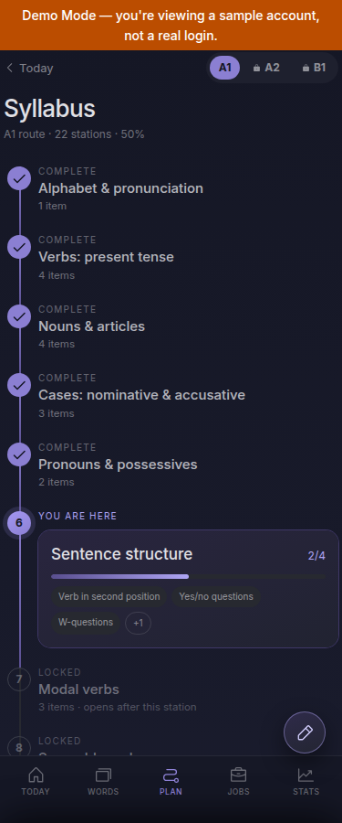
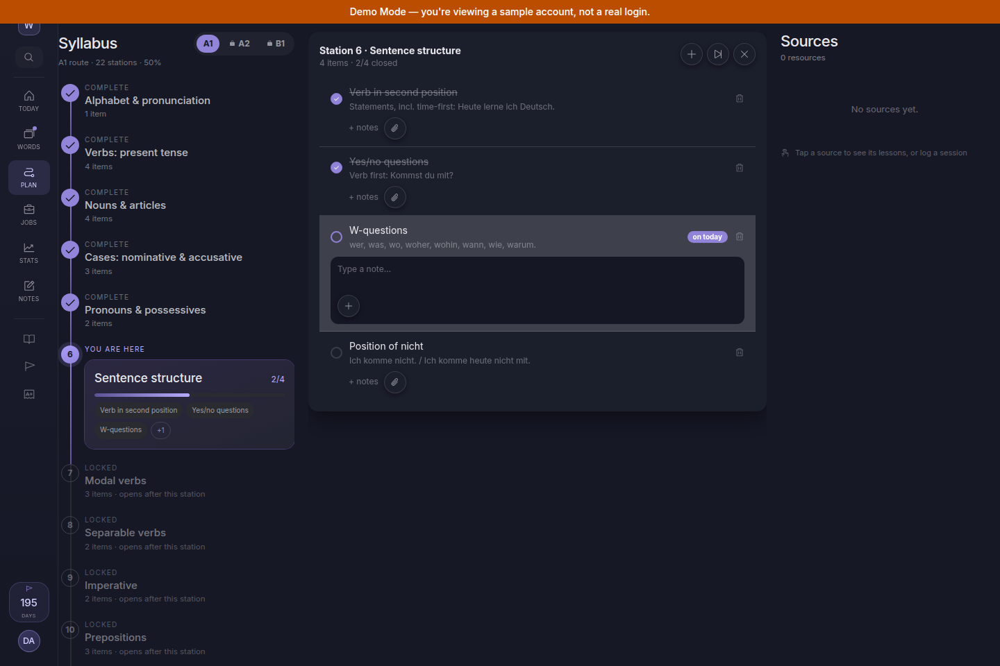

# AzubiWeg 🇩🇪

A platform for people preparing to move to Germany — built by someone doing exactly that.

I'm preparing for an Ausbildung in Germany: learning German, collecting documents,
tracking applications. This app solves the problems I hit along the way. **V1** is
a German vocabulary manager with spaced-repetition review, kept in **two-way sync
with my Obsidian vault**. **V2** adds the application side: a Job Search page
(kanban application tracker + a CV shelf, with best-effort autofill from a pasted
posting URL). **V3** adds a Learning Progress Hub — a CEFR syllabus, a day-by-day
study roadmap, exam-gated level progression, and self-tests — feeding a richer
dashboard.

> The whole UI runs on a dark-only design system ("Nocturne") with a 5-tab
> navigation model (Today/Words/Plan/Jobs/Stats) and a real desktop layout —
> see [CLAUDE.md](CLAUDE.md#the-nocturne-redesign-complete) for what changed.

<p align="center">
  
  
</p>

## What V1 does

- **Accounts** — email + password, JWT sessions.
- **Vocabulary manager** — search, filter by lesson, expand for full detail
  (meaning, IPA, grammar, example, pronunciation audio).
  <p>
    
    
  </p>
- **Automatic enrichment** — type `Zug, Bahnhof, fahren` and the backend fetches
  meaning (en.wiktionary), IPA + gender/plural/verb forms + an example sentence
  (de.wiktionary wikitext), and pronunciation audio (Wikimedia Commons recording,
  converted to MP3 with ffmpeg; free Microsoft Edge neural TTS as fallback).
- **Daily revision** — SM-2 spaced repetition, byte-compatible with the
  [Obsidian Spaced Repetition plugin](https://github.com/st3v3nmw/obsidian-spaced-repetition)'s
  scheduling (verified against real plugin output).
- **Obsidian vault sync** — the killer feature.

### How the vault sync works

The vault's `Vocab/master.md` is the **source of truth**. The app watches it (and
`inbox.md`, for words captured on iOS) and mirrors changes into Postgres within
seconds, then writes its own edits — added words, reviews, grades — back into the
exact same flashcard format, **byte-identical** (verified against a real vault
snapshot). Reviews done in the app and in Obsidian update the same
`<!--SR:!date,interval,ease-->` comments, so both schedulers stay in step.

## What V2 adds

- **Job Search** — a kanban application tracker (Wishlist → Applied → Interview →
  Offer / Rejected) with a permanent CV shelf beside it, so "which CV did I send
  where" never needs a second page. A CV here is just a file you already have
  (PDF/Word, tagged Lebenslauf or ATS) — no in-app builder to keep in sync with a
  PDF export; there used to be one (a form + live `@react-pdf/renderer` preview),
  retired in favor of this simpler, less-brittle model. New applications can be
  created from a pasted job-posting URL: a server-side fetch reads the page's
  `JobPosting` structured data (or falls back to its title/meta tags) to
  best-effort prefill company/role/location/portal — always editable, never
  required. Auto-logged timeline per application (status changes, notes,
  interviews), portal quick-links to platforms like GoAusbildung with
  stale-check reminders (since none of them offer account sync or public
  APIs), and stats: response rate, interview rate, average days to response,
  applications per week.

## What V3 adds

- **CEFR syllabus** — 174 seeded topics (grammar/vocab/skill) across A1, A2, and
  B1. Checking items off drives per-level completion percentage and "what's
  next" suggestions.
  <p>
    
    
  </p>
- **Exam-gated level progression** — sequential CEFR unlocking: a dedicated,
  separately-authored exam question bank (distinct from the practice-quiz
  bank below) gates each level, with a real pass-threshold/time-limit/
  attempt-rate-limit engine (`server/src/services/learning/exam.ts`) rather
  than letting levels unlock freely.
- **Day-by-day roadmap** — a 182-day (26-week) study plan to Goethe-exam
  readiness, generated live from syllabus progress, with a calendar view and
  overdue backlog.
- **Study-source registry** — register YouTube playlists, Nicos Weg chapters,
  or Duolingo units and self-log progress, since none of these platforms
  expose a progress API.
- **Self-tests & Goethe readiness** — a 163-question practice bank built from
  syllabus topics and vocab/SRS data, with weekly/monthly readiness rollups.
- **Word family** — related-word lookups from
  [DErivBase](https://www.ims.uni-stuttgart.de/forschung/ressourcen/lexika/derivbase/),
  tiered by relatedness score (closely related vs. same family but a
  stretch) and cross-referenced against your own tracked vocab.
- **Word-linked notes** — freeform notes can attach to a specific vocab word
  (surfaced on that word's detail view) in addition to a syllabus topic or
  roadmap task.
- **Activity tracking** — day-streaks and study-time history computed from
  real activity, feeding the dashboard's activity chart.

## Stack

| Layer | Choice |
|---|---|
| Frontend | React 19, TypeScript, Tailwind CSS 4, TanStack Query, React Router, Vite |
| Backend | Node.js, Express 5, TypeScript |
| Database | PostgreSQL, Prisma 7 |
| Auth | JWT (jsonwebtoken) + bcrypt |
| Vault sync | chokidar file watcher, custom markdown parser/writer |
| Enrichment | kaikki.org (German Wiktionary dump) + DErivBase, ffmpeg, msedge-tts |
| Kanban | @dnd-kit |
| Uploads | multer → per-user disk storage, auth-checked streaming |

## Data sources

Vocabulary enrichment (meanings, examples, IPA, declension/conjugation
tables, audio) is imported once from
[kaikki.org](https://kaikki.org/dictionary/German/)'s German Wiktionary
dump (`server/scripts/import-kaikki.ts`) rather than scraped live per word —
see Tatu Ylonen, "Wiktextract: Wiktionary as Machine-Readable Structured
Data," *Proceedings of the 13th Conference on Language Resources and
Evaluation (LREC)*, pp. 1317–1325, Marseille, 2022.

Word-family relations come from
[DErivBase](https://www.ims.uni-stuttgart.de/forschung/ressourcen/lexika/derivbase/)
v2.0 (Institute for Natural Language Processing, University of Stuttgart),
licensed CC BY-SA 3.0 (`server/scripts/import-derivbase.ts`).

## Running it

```bash
# 1. Database — either:
docker compose up -d               # standard Postgres in Docker, or
cd server && npm run db:start      # no Docker/root needed (embedded-postgres)

# 2. Server
cd server
npm install
cp .env.example .env               # set JWT_SECRET
npx prisma migrate dev
npm run dev                        # http://localhost:3000

# 3. Client
cd client
npm install
npm run dev                        # http://localhost:5173 (proxies /api)
```

Then register, and (optionally) link your Obsidian vault under **Settings** —
point it at the vault root, the folder containing `Vocab/master.md`.

## Tests

```bash
cd server && npm test
```

Covers the vault sync's byte-identical round-trip, SRS scheduling parity with
the Obsidian plugin, the kaikki.org enrichment pipeline's word resolution,
and pure-logic suites for applications and the Learning Hub (roadmap
generation, exam gating, quizzes, activity tracking). Server-side only — no
dedicated client test runner; UI changes are verified by driving the app in
a real browser (see [CLAUDE.md](CLAUDE.md#testing-conventions)).

## Deployment

Self-hostable on a free-tier VPS — see [docs/DEPLOYMENT.md](docs/DEPLOYMENT.md)
for the full runbook (GCP e2-micro, Caddy + auto-TLS, DuckDNS DNS with an
`eu.org` application pending, and bridging the Obsidian vault sync over
OneDrive/rclone when the app isn't on the same machine as the vault).

## Roadmap

See [docs/ROADMAP.md](docs/ROADMAP.md) for the full ecosystem plan and feature specs.

- **V1** — vocabulary manager, SM-2 spaced repetition, automatic Wiktionary
  enrichment, two-way Obsidian vault sync.
- **V2** — Job Search: a kanban application tracker with a CV shelf,
  best-effort autofill from a pasted posting URL, portal quick-links, and
  application stats.
- **V3 — Learning Progress Hub** — CEFR syllabus, a generated day-by-day
  study roadmap, exam-gated level progression, self-tests, word family
  lookups, word-linked notes, and activity tracking.
- **The Nocturne redesign** — a complete UI/UX rebuild against a dark-only
  design system, a 5-tab navigation model, and a real desktop (lg+) layout.
  Full 20-phase history in
  [CLAUDE.md](CLAUDE.md#the-nocturne-redesign-complete). A small bug backlog
  is tracked in `docs/KNOWN_ISSUES.md` and is being worked through now.
- **Now** — an app-wide bug-fixing pass, vocab PDF export + CLI (the last of
  V1's scope), dashboard upgrades (certificates, GitHub activity), and the
  rest of V5 (GitHub Actions CI, calendar integration, grammar
  micro-lessons).
- **Long run, unscheduled** — Ausbildung opportunity discovery (search/
  filters/bookmarks), a cover letter assistant, a Europass CV template,
  automated ATS checks, a salary & cost planner, and a Germany knowledge
  base.

## Acknowledgments

Designed, built, and maintained solo. AI pair-programming (Claude Code and
Claude Design) is used deliberately as part of the toolchain — for
implementation speed and to prototype UI handoffs.
