# AzubiWeg 🇩🇪

A platform for people preparing to move to Germany — built by someone doing exactly that.

I'm preparing for an Ausbildung in Germany: learning German, collecting documents,
tracking applications. This app solves the problems I hit along the way:

- **Words** — a German vocabulary manager with spaced-repetition review, kept in
  **two-way sync with my Obsidian vault**.
- **Plan** — a CEFR study journey from A1 to B1: daily tickets, self-tests,
  checkpoints and an exam gate per level.
- **Jobs** — an application pinboard with a CV shelf and best-effort autofill from a
  pasted posting URL.
- **Stats** and **Notes** — where you stand and what you've learned along the way.

> The UI is the **Bento "Sticker Club"** design: a bento grid in a playful sticker style (chunky ink outlines, hard
> offset shadows, slightly rotated tiles), light and dark following the OS, and three real breakpoints. Six tabs:
> Today · Words · Plan · Jobs · Stats · Notes, plus Settings and a focused Review session — see
> [CLAUDE.md](CLAUDE.md#the-bento-sticker-club-redesign-shipped-2026-09-25).

<p align="center">
  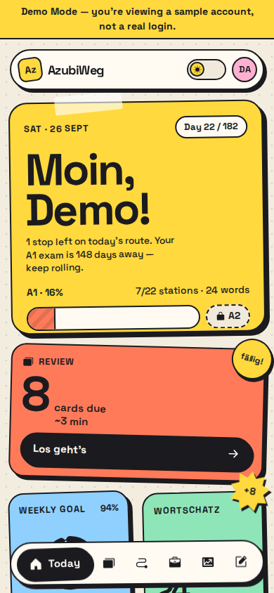
  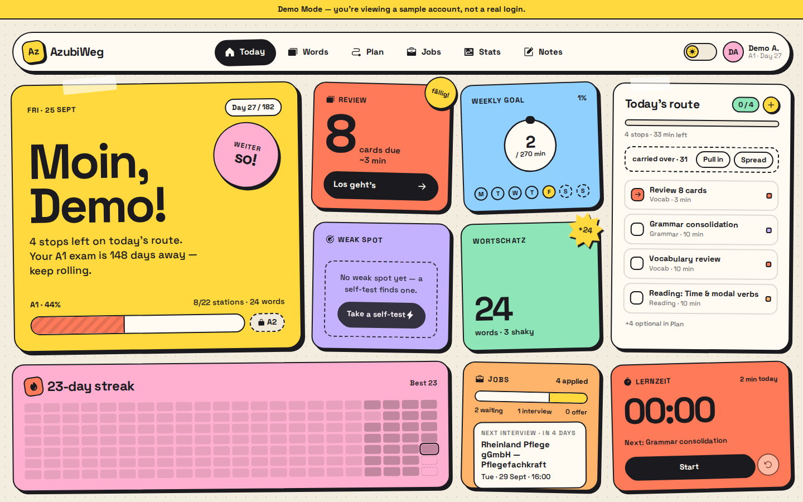
</p>

## Today

The home screen: today's route (the tasks due, with a "carried over" row to pull
in or spread missed work), cards due for review, a weekly-goal ring, your weak
spot, word count, a streak heatmap, the next job interview, and **Lernzeit** — one
app-wide task timer that tracks active study time.

## Words

<p>
  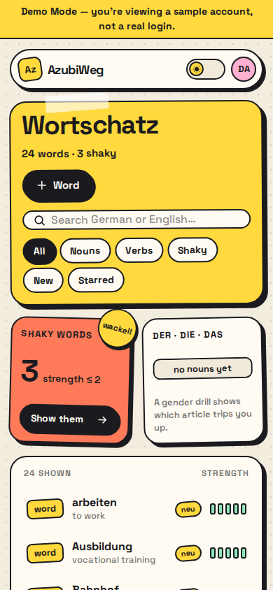
  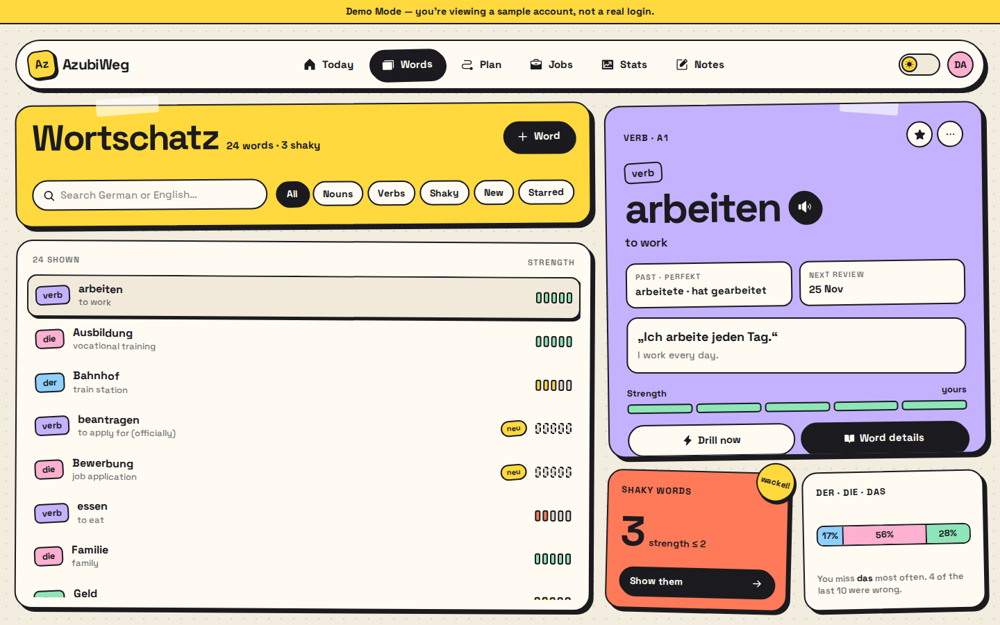
</p>

- **Vocabulary manager** — search, filter (Nouns, Verbs, Shaky, New, Starred), and
  strength pips per word. The detail view has meaning, example, pronunciation
  audio, gender and plural rules, case tables, verb conjugations and the word
  family.
- **Automatic enrichment** — type `Zug, Bahnhof, fahren` and the backend fills in
  meaning, IPA, gender/plural/verb forms and an example sentence from a local
  import of the German Wiktionary, plus pronunciation audio (a Wikimedia Commons
  recording converted to MP3 with ffmpeg; free Microsoft Edge neural TTS as
  fallback).
- **Review session** — flashcards in three modes (word → meaning, meaning → word,
  der · die · das) with Again/Hard/Good/Easy, undo, and keyboard shortcuts.
  Scheduling is SM-2, byte-compatible with the
  [Obsidian Spaced Repetition plugin](https://github.com/st3v3nmw/obsidian-spaced-repetition)
  (verified against real plugin output).
  <p>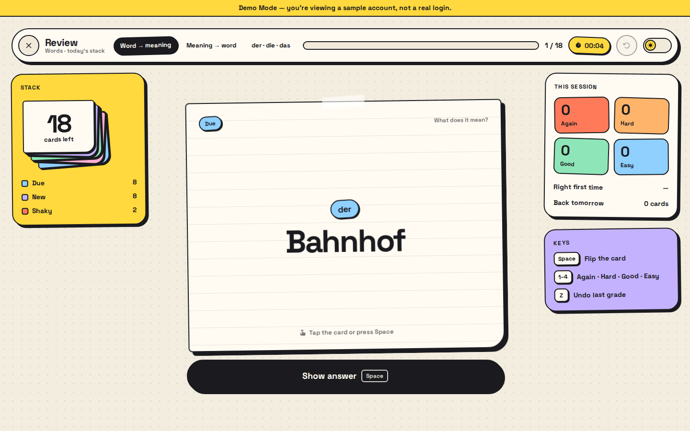</p>
- **Obsidian vault sync** — the killer feature.

### How the vault sync works

The vault's `Vocab/master.md` is the **source of truth**. The app watches it and
mirrors changes into Postgres within seconds, then writes its own edits — added
words, reviews, grades — back into the exact same flashcard format,
**byte-identical** (verified against a real vault snapshot). Reviews done in the app
and in Obsidian update the same `<!--SR:!date,interval,ease-->` comments, so both
schedulers stay in step. Words captured on the phone into `Vocab/inbox.md` are
picked up on "Sync now". Notes can be written to the vault too, one markdown file
each under `Notizen/`.

## Plan

<p>
  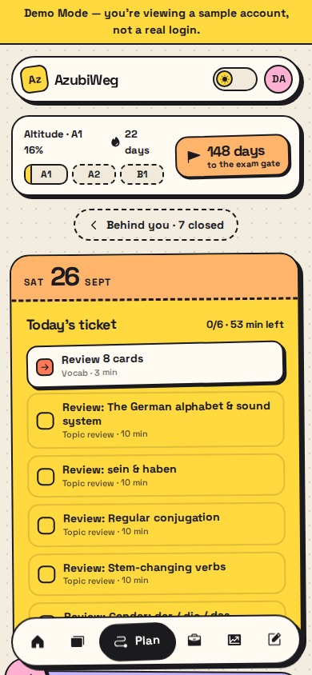
  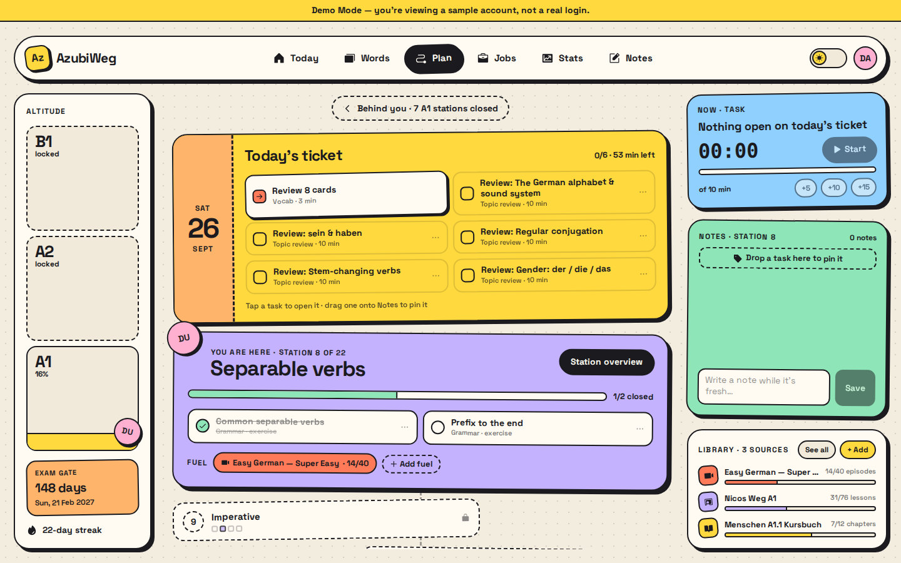
</p>

- **Journey** — each CEFR level (A1, A2, B1) is a route of stations (22–23 per
  level) built from a 407-item syllabus of grammar, vocabulary and skill topics.
- **Today's ticket** — the day's core tasks sized to your study capacity, with
  optional extras to pull ahead and a week view with your pace. Each task opens a
  workspace with exercises, audio, recording, a timer and notes.
- **Self-tests** — multiple choice and fill-in from a 160-question practice bank,
  a gender drill, and listen & type.
- **Checkpoints and mock exam** — scoped mixed tests at stations 7, 14 and 21, and a
  practice run of the level exam two weeks before your exam date.
- **Exam gate** — levels unlock in order. Each has its own exam bank (20 questions,
  20 minutes, 70% to pass) with a real time limit and attempt rate limit
  (`server/src/services/learning/exam.ts`) instead of levels unlocking freely.
- **Library** — your study sources (Nicos Weg, textbooks, podcasts, YouTube) with
  covers, progress you log by tapping +1, and a link to the station each one
  serves, since none of these platforms offer a progress API.

## Jobs

<p>
  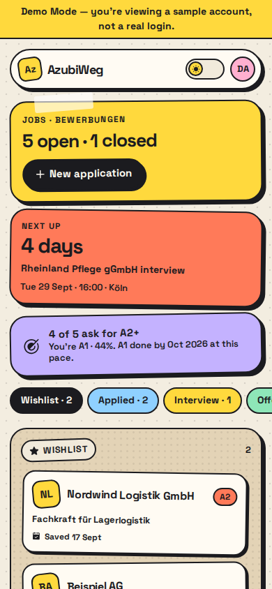
  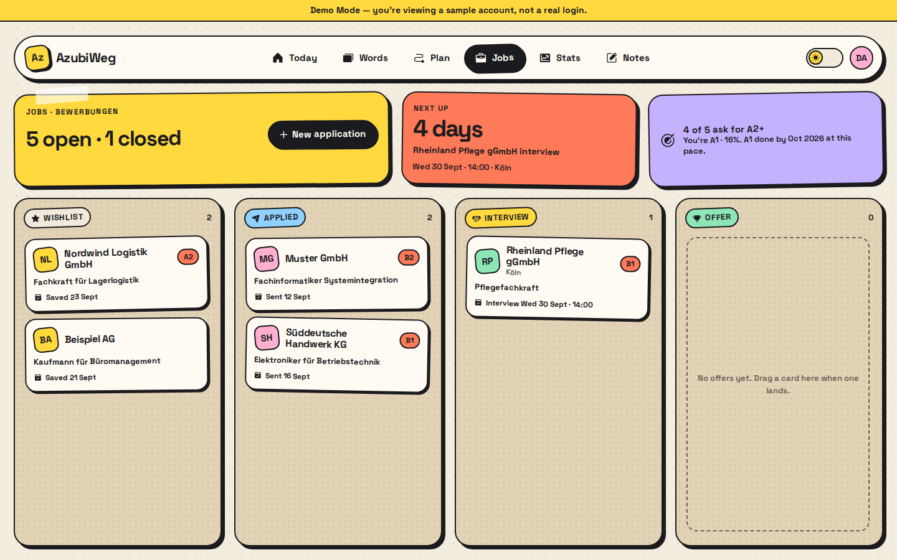
</p>

- **Pinboard** — drag applications through Wishlist → Applied → Interview → Offer,
  with rejections counted as closed. On phones the stages become tabs.
- **Autofill from a link** — paste a job-posting URL and a server-side fetch reads
  the page's `JobPosting` data (or its title/meta tags) to prefill company, role and
  location. It also detects the German level the posting asks for. Everything stays
  editable.
- **Per-application detail** — a timeline of status changes, notes and dated
  interviews (feeding "Next up"), the CV version it went out with, and interview
  phrases: a curated bank plus your own.
- **CV shelf** (in Settings) — CVs, cover letters and certificates as the files you
  already have (PDF/Word), with version history and a default CV for new
  applications.

## Stats

<p>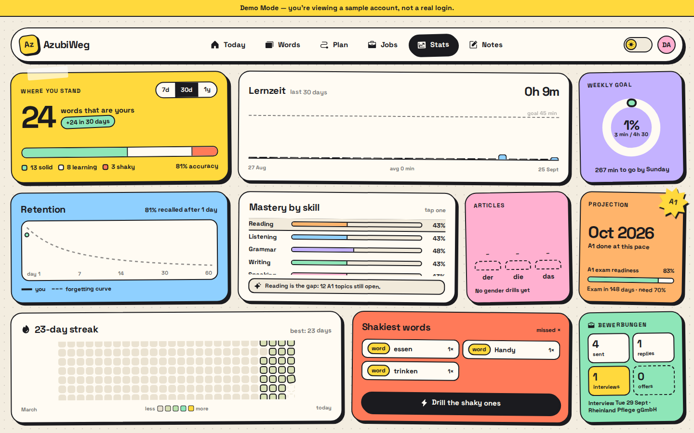</p>

Words by strength and accuracy (7 days / 30 days / 1 year), Lernzeit over time,
the weekly goal, retention against the forgetting curve, mastery by skill,
article accuracy, a projection of when you'll finish the level and how ready you
are for the exam, the streak heatmap, your shakiest words, and application
stats.

## Notes

<p>
  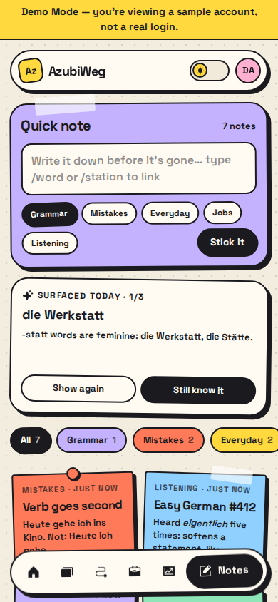
  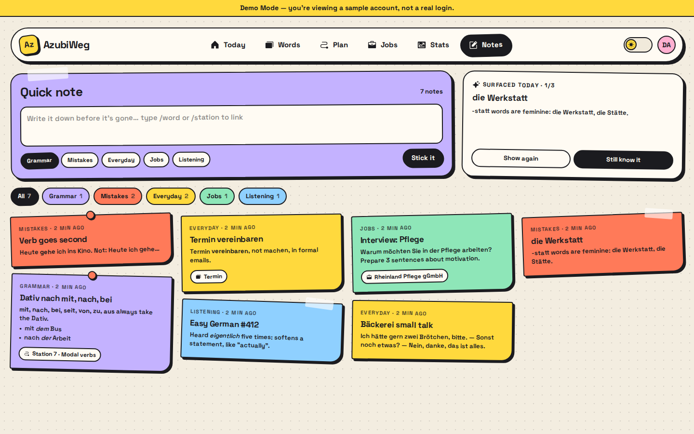
</p>

A sticky wall of notes in five categories (Grammar, Mistakes, Everyday, Jobs,
Listening), with pinning, attachments, and `/word`, `/station`, `/source` and `/job`
links. Grammar and Mistakes notes resurface under **Surfaced today** until you
mark them as known.

## Also

- **Settings** — study capacity and days, new words per day, exam date, Obsidian
  vault link and sync, plan reset, and the CV shelf.
- **Command palette** — ⌘K / Ctrl+K search, plus G-letter shortcuts to jump
  between tabs.
- **Accounts** — email + password, JWT sessions, and a demo account for portfolio
  visitors.

## Stack

| Layer | Choice |
|---|---|
| Frontend | React 19, TypeScript, Tailwind CSS 4, TanStack Query, React Router, Vite |
| UI | Phosphor icons, Space Grotesk, TipTap (notes), @dnd-kit (drag and drop) |
| Backend | Node.js, Express 5, TypeScript |
| Database | PostgreSQL, Prisma 7 |
| Auth | JWT (jsonwebtoken) + bcrypt |
| Vault sync | chokidar file watcher, custom markdown parser/writer |
| Enrichment | kaikki.org (German Wiktionary dump) + DErivBase, ffmpeg, msedge-tts |
| Uploads | multer → per-user disk storage, auth-checked streaming |

## Data sources

Vocabulary enrichment (meanings, examples, IPA, declension/conjugation
tables) is imported once from
[kaikki.org](https://kaikki.org/dictionary/German/)'s German Wiktionary
dump (`server/scripts/import-kaikki.ts`) rather than scraped live per word —
see Tatu Ylonen, "Wiktextract: Wiktionary as Machine-Readable Structured
Data," *Proceedings of the 13th Conference on Language Resources and
Evaluation (LREC)*, pp. 1317–1325, Marseille, 2022.

Word-family relations come from
[DErivBase](https://www.ims.uni-stuttgart.de/forschung/ressourcen/lexika/derivbase/)
v2.0 (Institute for Natural Language Processing, University of Stuttgart),
licensed CC BY-SA 3.0 (`server/scripts/import-derivbase.ts`).

## Running it

```bash
# 1. Database — either:
docker compose up -d               # standard Postgres in Docker, or
cd server && npm run db:start      # no Docker/root needed (embedded-postgres)

# 2. Server
cd server
npm install
cp .env.example .env               # set JWT_SECRET
npx prisma migrate dev
npm run dev                        # http://localhost:3000

# 3. Client
cd client
npm install
npm run dev                        # http://localhost:5173 (proxies /api)
```

Then register, and (optionally) link your Obsidian vault under **Settings** —
point it at the vault root, the folder containing `Vocab/master.md`. For sample
data, set `DEMO_MODE_ENABLED=true` and run `npm run seed:demo` in `server/`.

## Tests

```bash
cd server && npm test
```

Covers the vault sync's byte-identical round-trip, SRS scheduling parity with
the Obsidian plugin, the kaikki.org enrichment pipeline's word resolution,
and pure-logic suites for applications and the learning plan (roadmap
generation, exam gating, quizzes, activity tracking). Server-side only — no
dedicated client test runner; UI changes are verified by driving the app in
a real browser (`client/scripts/shots.mjs` sweeps every page at each breakpoint
in light and dark, and flags console errors and overflow).

## Deployment

Self-hostable on a free-tier VPS — see [docs/DEPLOYMENT.md](docs/DEPLOYMENT.md)
for the full runbook (Oracle Cloud Ampere ARM, Caddy + auto-TLS, DuckDNS DNS
with an `eu.org` application pending, and bridging the Obsidian vault sync
over OneDrive/rclone when the app isn't on the same machine as the vault).

## Roadmap

See [docs/ROADMAP.md](docs/ROADMAP.md) for the full ecosystem plan and feature specs.

- **Shipped** — vocabulary manager with SM-2 review and two-way Obsidian sync;
  the Jobs pinboard with CV shelf; the A1–B1 learning plan with self-tests and
  exam gates; and the Bento "Sticker Club" redesign (September 2026).
- **Now** — post-launch bug fixing and the remaining Bento polish (tracked in
  `docs/KNOWN_ISSUES.md`), vocab PDF export + CLI, GitHub Actions CI, calendar
  integration, and grammar micro-lessons.
- **Long run, unscheduled** — Ausbildung opportunity discovery (search/
  filters/bookmarks), a cover letter assistant, a Europass CV template,
  automated ATS checks, a salary & cost planner, and a Germany knowledge
  base.

## Acknowledgments

Designed, built, and maintained solo. AI pair-programming (Claude Code and
Claude Design) is used deliberately as part of the toolchain — for
implementation speed and to prototype UI handoffs.
